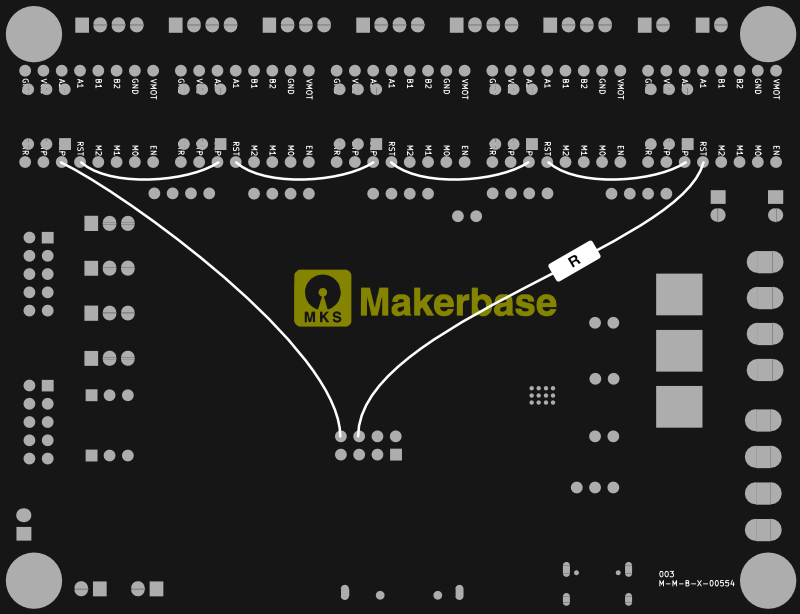

To modify the MKS TinyBee to work with UART you'll need to jump various points on the board.

The resistor I used was 330R - you may need to try higher or lower.

Before installing the drivers switch all the dip switches to low.

Set the address of the X, Y and Z:

X = off off off
Y = on off off
Z = off on off

E0 is the secondary X - so set this to the same as X.
E1 is the secondary Y - so set this to the same as Y.
