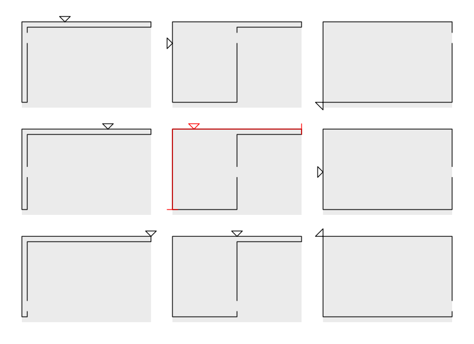

There are a few different options for drive and pulley configurations depending on what you want to achieve.

V2 is suggested for new builds as it's a much neater layout, allowing one end of the plotter to be free of belt and any kind of wiring.

## V1 Original

* 2 x stepper mount
* 2 x pulley mount

## V1 with 4-wheel-drive

* 2 x stepper mount
* 2 x stepper corner mount

## V2

* 2 x stepper corner mount
* 2 x pulley mount

## V2 with central drive

* 1 x central drive
* 4 x pulley mount

This configuration mounts the two steppers together, place it in the middle of the rail.

## 4-wheel-drive tensioning procedure

Use the following procedure to make sure the pulley teeth are synchronised.

1. Power off the plotter.
2. Disconnect the two 4WD steppers from the controller board and loosen the two grub screws on both the 4WD pulleys.
3. Adjust the tension on both belts.
4. Power the plotter on.
5. Ensure the 4WD pulleys are engaged with the belt.
6. Tighten the grub screws on the 4WD pulleys, ensuring that they are not tightened against the flat of the D shaft. The pulley should not move as you tighten the grub screws.
7. Power the plotter off.
8. Reconnect the 4WD steppers.
9. Power the plotter on.

## Thoughts on drive position

If our aim is to drive the belt somewhere in the middle of the belt then there's only really one position.

Below is a diagram showing the middle of the belt at various different extents.

The red line shows the range, the red arrow shows the middle of the range. This is the ideal position for the driven pulley.

For 4-wheel-drive we would want to position motors at either end of the range.

