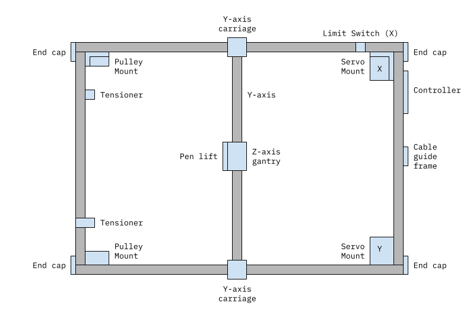

Only print one Y-axis folder - depending on what extrusion profile you are using for your y-axis.

# How long should my extrusions be?

First work out your plotting area. Let's say you want to build an A2 machine; 600 x 420 (rounded up)

X extrusion = width + 240 = 600 + 240 = 840mm

Y extrusion = length + 180 = 420 + 180 = 600mm

Y axis = Y extrusion - 13 = 587mm

These numbers have a bit of excess to allow a bit of movement around the outside of the plot area.

# Hardware build guide

1. Print out a corner pulley mount and check that it fits snuggly into your v-slot extrusion. If it doesn't you might need to recalibrate your printer.
2. Print out all the parts. The number at the end of the filename is the quantity you'll need — so Pulley_2.3mf means you need 2.
3. Layout out the extrusion and printed parts on a table according to the diagram above, work out where you will need to insert t-nuts. This is important because once you start assembly certain t-nuts are impossible to insert without loosening and/or disassembling.
4. Build up the z-axis gantry and slide it on to the y-axis.
5. Build up the y-axis carriages and attach them to the y-axis extrusion. All pulleys sit on a single shim and have two shims between the F605 bearings. Keep the screws that hold it to the y-axis loose for now.
6. Install the end caps and servo mounts to the extusions so you have an open sided C shape. Note the orientation of the servo mounts, they are opposite ways up with the flat part in the middle of the extrusion.
7. Slide the whole y-axis assembly on to the extrusion.
8. Install the pulley mounts, end caps and attach the final extrusion to close the frame.
9. Adjust all the mount screws until the frame is square. Adjust the eccentric nuts. The y-axis should slide left to right freely. Tighten the screws that hold the y-axis in place.
10. Install all the pulleys. They pulleys should sit on a single shim spacer, with two shims in between the two bearings.
11. Install the servos in to the servo mounts, being sure to vertically align the toothed pulley with the pulleys on the mount.
12. Install belts and attach to gantry. They should not be tight at this stage — but should not droop. Leave at least 80mm of extra belt on the back side of the z-axis gantry.

13. Install belt tensioners and set them to loose. Tension the belts to the same tension. It is vital that the belts are the same tension, if they are not at the same tension then the y-axis will be at an angle. Move the y-axis against the corner pulley mounts and adjust until both y-axis carriages rest against their respective corner pulley mounts. If the tension is different you will see that one y-axis carriage is further away from the corner pulley mount than the other. Once you have manually tensioned the belts so that the y-axis carriage are less than a few mm away from the corner pulley mounts use the belt tensioners to fine tune.
14. Build up pen lift and install on to gantry. Attach the solenoid to the heater output on the controller board.
15. Install limit switches and wire to X-MIN and Y-MIN connector on board.

